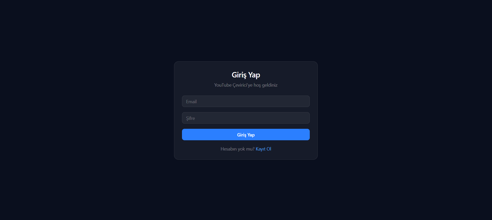
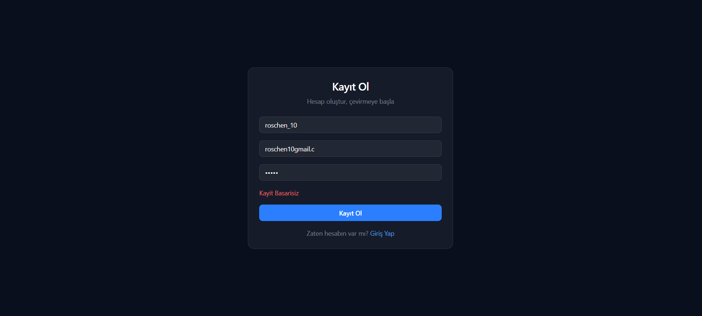

# 🎬 YouTube Translator — Transcript Translation & Summarization

> A full-stack web application that fetches YouTube video transcripts and automatically translates and summarizes them into Turkish using AI.

🔗 **Live Demo:** [youtube-transcript-frontend-qivq.onrender.com](https://youtube-transcript-frontend-qivq.onrender.com)

---

## 📸 Screenshots


### Login Page


### Login Page


### Validation Error — Register



---

## 💡 Why I Built This

Following English YouTube content can be time-consuming. This project automatically translates and summarizes any YouTube video transcript into Turkish — making it much faster to understand the content.

It also served as a personal learning project to experience building and deploying a full-stack application end-to-end.

---

## ✨ Features

- 🔐 **JWT Authentication** — Secure user registration and login
- 🎯 **Transcript Fetching** — Retrieves YouTube transcripts via ScrapeCreators API
- 🤖 **AI Translation & Summarization** — Translates and summarizes content using Groq API (Llama 3.3)
- 💾 **Video Cache** — If the same video is requested again, it's served from the database instead of calling the API again
- 📋 **Translation History** — Each user has their own private translation history
- 🚦 **Rate Limiting** — Prevents API abuse with per-endpoint request limits
- ✅ **Input Validation** — Server-side validation using express-validator
- 🌙 **Dark UI** — Modern dark interface built with Shadcn/UI and Tailwind CSS

---

## 🛠️ Tech Stack

| Layer | Technology |
|-------|-----------|
| Frontend | React.js (Vite), Tailwind CSS, Shadcn/UI |
| Backend | Node.js, Express.js |
| Database | MongoDB, Mongoose |
| AI | Groq SDK (Llama-3.3-70b-versatile) |
| Transcript | ScrapeCreators API |
| Auth | JWT (jsonwebtoken), bcrypt |
| Validation | express-validator |
| Rate Limiting | express-rate-limit |
| Deploy | Render (Backend + Frontend), MongoDB Atlas |

---

## 📂 Project Structure

```
youtube-transcript-translation/
├── backend/
│   ├── controller/
│   │   ├── authController.js       # Register & Login logic
│   │   └── transcriptController.js # Transcript fetching, cache, history
│   ├── middleware/
│   │   ├── authMiddleware.js       # JWT verification
│   │   └── rateLimiter.js          # Rate limiting
│   ├── models/
│   │   ├── User.js                 # User schema
│   │   └── Transcript.js           # Transcript schema
│   ├── routes/
│   │   ├── authRoutes.js
│   │   └── transcriptRoutes.js
│   ├── services/
│   │   └── groqService.js          # Groq AI integration
│   └── server.js
├── frontend/
│   └── src/
│       ├── components/
│       │   ├── SearchBar.jsx
│       │   ├── ResultCard.jsx
│       │   ├── HistoryList.jsx
│       │   ├── Login.jsx
│       │   └── Register.jsx
│       └── App.jsx
```

---

## ⚙️ Getting Started

### Prerequisites

- Node.js v18+
- MongoDB (local or Atlas)
- Groq API Key → [console.groq.com](https://console.groq.com)
- ScrapeCreators API Key → [scrapecreators.com](https://scrapecreators.com)

### Backend

```bash
cd backend
npm install
node server.js
```

Create a `.env` file inside the `backend/` folder:

```env
PORT=5000
MONGO_URI=your_mongodb_connection_string
JWT_SECRET=your_jwt_secret
GROQ_API_KEY=your_groq_api_key
ScrapeCreators_API_KEY=your_scrapecreators_api_key
```

### Frontend

```bash
cd frontend
npm install
npm run dev
```

Create a `.env` file inside the `frontend/` folder:

```env
VITE_API_URL=http://localhost:5000
```

---

## 🔐 API Endpoints

### Auth

| Method | Endpoint | Description |
|--------|----------|-------------|
| POST | `/api/auth/register` | Register a new user |
| POST | `/api/auth/login` | Login and receive JWT token |

### Transcript (Protected — requires Bearer token)

| Method | Endpoint | Description |
|--------|----------|-------------|
| POST | `/api/transcript/get-transcript` | Fetch, translate and summarize a video |
| GET | `/api/transcript/history` | Get user's translation history |

---

## 🔒 Technical Highlights

- **Video Cache:** If a user requests a video they've already translated, it's returned directly from the database — no unnecessary API calls
- **JWT Middleware:** All transcript endpoints require a valid token
- **Rate Limiting:** `/get-transcript` is limited to 5 requests per minute per user
- **Input Validation:** All user inputs are validated server-side with express-validator
- **Error Handling:** All controllers use try/catch with proper HTTP status codes

---

## 🌱 What I Learned

- Designing and building a full-stack application architecture
- JWT-based authentication and authorization
- Integrating third-party APIs (Groq, ScrapeCreators)
- MongoDB schema design and Mongoose usage
- Cache mechanism to reduce API costs
- Rate limiting for API security
- Production deployment with Render and MongoDB Atlas

---

## 👨‍💻 Author

**Emir Baran Kadırhan**

- GitHub: [@EmirBaranKadirhan](https://github.com/EmirBaranKadirhan)
- LinkedIn: [Emir Baran Kadırhan](https://www.linkedin.com/in/emirkadirhan/)
